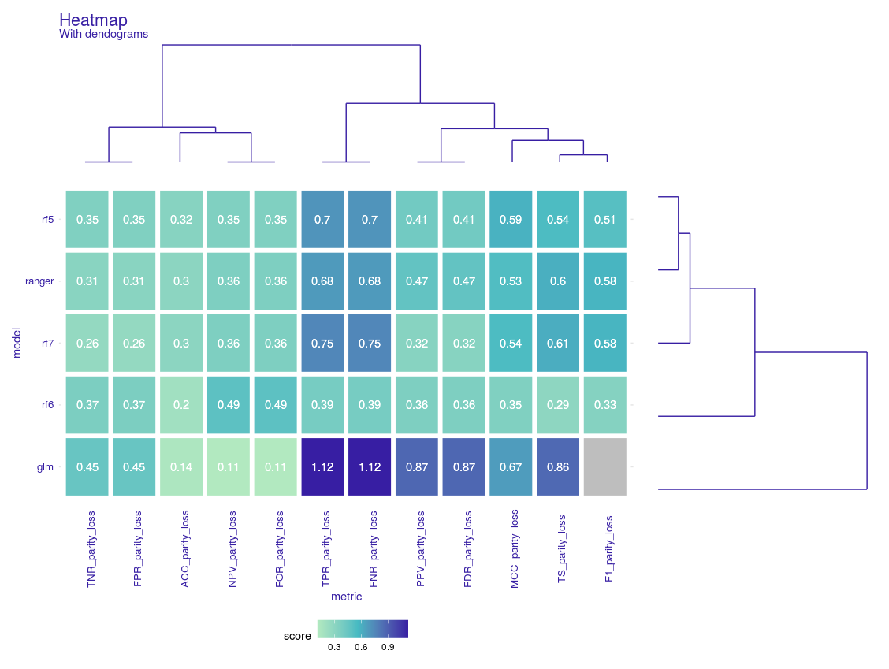

  <!-- badges: start -->
  [](https://codecov.io/gh/jakwisn/FairModels?branch=master)

  [](https://github.com/jakwisn/FairModels/actions)
  <!-- badges: end -->
  
  

# FairModels 
## Overwiew

`FairModels` is package for fairness audit and visualization. Uses models explained with [DALEX](https://modeloriented.github.io/DALEX) and calculates fairness metrics based on confusion matrix for protected group.  Allows to compare and gain information about various machine learning models. *Make sure your models are classifying protected groups similarly*.


## Preview

<center>

</center>

### Used metrics

* **TPR** - True Positive Rate (Sensitivity, Recall)
* **TNR** - True Negative Rate (Specificity)
* **PPV** - Positive Predictive Value (Precision)
* **NPV** - Negative Predictive Value
* **FNR** - False Negative Rate
* **FPR** - False Positive Rate
* **FDR** - False Discovery Rate
* **FOR** - False Omision Rate
* **TS**  - Threat Score
* **ACC** - Accuracy
* **F1**  - F1 Score
* **MCC** - Matthews correlation coefficient

more on those metrics : [Confusion Matrix](https://en.wikipedia.org/wiki/Confusion_matrix)

### How to use it

```
library(DALEX)

# load data
data(compas)

# making classifiers
rf_compas <- ranger(Two_yr_Recidivism ~., data = compas, probability = TRUE)
lr_compas <- glm(Two_yr_Recidivism~., data=compas, family=binomial(link="logit"))
rf_compas_2 <- ranger(Two_yr_Recidivism ~ Age_Above_FourtyFive+Misdemeanor, data = compas, probability = TRUE)

# numeric target values
y_numeric <- as.numeric(compas$Two_yr_Recidivism)-1

# explaining with dalex
rf_explainer_1 <- explain(rf_compas, data = compas[,-1], y = y_numeric, label = "ranger")
lr_explainer_1 <- explain(lr_compas, data = compas[,-1], y = y_numeric, label = "logistic_regresion")

# creating fairness object
fobject <- create_fairness_object(rf_explainer_1, lr_explainer_1, 
                                  data = compas, 
                                  outcome = "Two_yr_Recidivism", 
                                  group = "Ethnicity",
                                  base = "Caucasian")

# what to do with fairness object:
plot(fobject)
plot_heatmap(fobject)
plot(create_fairness_pca(fobject))
plot_performance_with_fairness(fobject)
plot_stacked_barplot(fobject)
plot_two_models(fobject, fairness_metric = "FNR")
```

`fairness object` consists of 
* x, ...  - explainer or list of explainers
* data    - full data (diffrent explainers can be trained on diffrent data)
* outcome - target variable
* group   - protected variable, usually race, sex, etc...
* base    - subgroup, base on which to calculate metrics. Metric on base subgroup is always 1. Usually specific race, sex etc...


early version of tutorial: [Tutorial](https://modeloriented.github.io/FairModels/articles/tutorial.html)


