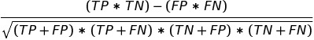
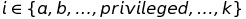

# fairmodels 

  <!-- badges: start -->
  [](https://codecov.io/gh/ModelOriented/fairmodels?branch=master)
  [](https://github.com/ModelOriented/fairmodels/actions)
  <!-- badges: end -->
  
  
## Overview

Flexible tool for bias detection, visualization, and mitigation. Uses models explained with [DALEX](https://modeloriented.github.io/DALEX/) and calculates fairness metrics based on confusion matrix for protected group.  Allows to compare and gain information about various machine learning models. Mitigate bias with various pre-processing and post-processing techniques. *Make sure your models are classifying protected groups similarly*.


## Preview


## Installation

```
devtools::install_github("ModelOriented/fairmodels")
```

## Example
Checking fairness is easy! 

```
library(fairmodels)
library(ranger)
library(DALEX)

data("german")

# ------------ step 1 - create model(s)  -----------------

lm_model <- glm(Risk~.,
                data = german,
                family=binomial(link="logit"))

rf_model <- ranger(Risk ~.,
                   data = german,
                   probability = TRUE,
                   num.trees = 200)

# ------------  step 2 - create explainer(s)  ------------

# numeric y for explain function
y_numeric <- as.numeric(german$Risk) -1

explainer_lm <- explain(lm_model, data = german[,-1], y = y_numeric)
explainer_rf <- explain(rf_model, data = german[,-1], y = y_numeric)

# ------------  step 3 - fairness check  -----------------

fobject <- fairness_check(explainer_lm, explainer_rf,
                          protected = german$Sex,
                          privileged = "male")

 
print(fobject)
plot(fobject)

```

Compas recidivism data use case: [Basic tutorial](https://modeloriented.github.io/fairmodels/articles/Basic_tutorial.html)   
Bias mitigation techniques on Adult data: [Advanced tutorial](https://modeloriented.github.io/fairmodels/articles/Advanced_tutorial.html)

## How to evaluate fairness? 

<p align="center">

</p>


### Fairness checking is flexible

`fairness_check` parameters are    
* x, ...  - `explainers` and `fairness_objects` (products of fairness_check).   
* protected - factor with different subgroups as levels. Usually specific race, sex etc...   
* privileged - subgroup, base on which to calculate parity loss metrics.    
* cutoff  - custom cutoff, might be single value - cutoff same for all subgroups or vector - for each subgroup individually. Affecting only explainers.   
* label - character vector for every explainer.   

Models might be trained on different data, even without protected variable. May have different cutoffs which gives different values of metrics. 
`fairness_check()` is place where `explainers` and `fairness_objects` are checked for compatibility and then glued together.  
So it is possible to to something like this: 

```
fairness_object <- fairness_check(explainer1, explainer2, ...)
fairness_object <- fairness_check(explainer3, explainer4, fairness_object, ...)
```
even with more `fairness_objects`!

If one is even more keen to know how `fairmodels` works and what are relations between objects, please look at this diagram [class diagram](https://github.com/ModelOriented/fairmodels/blob/master/man/figures/class_diagram.png)


## Metrics used

There are 13 metrics based on confusion matrix : 

| Metric | Formula | Full name | Other names |
|--------|---------|-----------|-------------|
| TPR |  | true positive rate | equal opportunity, sensitivity, recall
| TNR |  | true negative rate | specificity
| PPV |  | positive predictive value | predictive parity, precision
| NPV |  | negative predictive value | 
| FNR |  | false negative rate |
| FPR |  | false positive rate | predictive equality
| FDR |  | false discovery rate
| FOR |  | false omission rate |
| TS |   | threat score |
| STP |  | statistical parity |
| ACC |  | accuracy |
| F1 |   | F1 score |
| MCC |  | Matthews correlation coefficient |

*and their parity loss.*   
How is *parity loss* calculated? 


Where  denote the membership to unique subgroup from protected variable

some fairness metrics like *Equalized odds* are satisfied if parity loss in both *TPR* and *FPR* is low 

## Related works

Zafar,Valera, Rodriguez, Gummadi (2017)  https://arxiv.org/pdf/1610.08452.pdf
