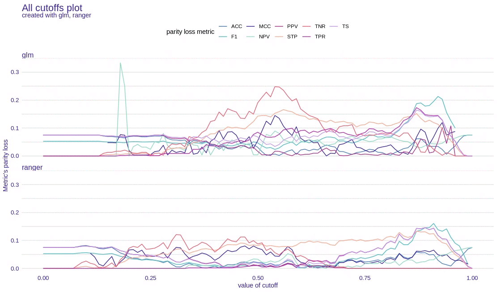
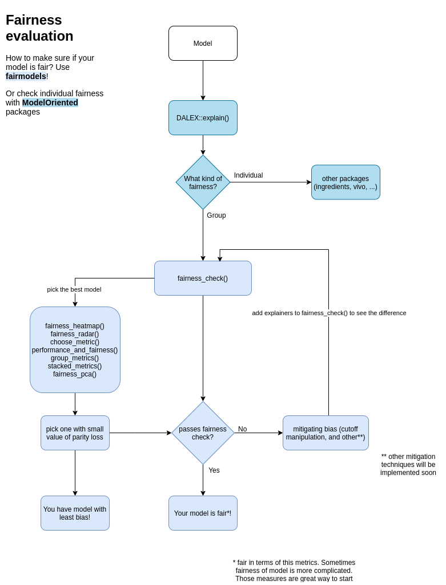
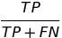
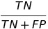
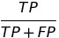
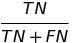
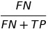
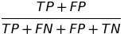
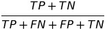

# fairmodels  

  <!-- badges: start -->
  [](https://codecov.io/gh/ModelOriented/fairmodels?branch=master)
  [](https://github.com/ModelOriented/fairmodels/actions)
   [](https://cran.r-project.org/package=fairmodels)
   
   [](http://drwhy.ai/#eXtraAI)
  <!-- badges: end -->
  
  
## Overview

Flexible tool for bias detection, visualization, and mitigation. Use models explained with [DALEX](https://modeloriented.github.io/DALEX/) and calculate fairness classification metrics based on confusion matrices using `fairness_check()` or try newly developed module for regression models using `fairness_check_regression()`. R package fairmodels allows to compare and gain information about various machine learning models. Mitigate bias with various pre-processing and post-processing techniques. *Make sure your models are classifying protected groups similarly*.


## Preview



## Installation
Install it from CRAN:
```
install.packages("fairmodels")
```
or developer version from GitHub:
```
devtools::install_github("ModelOriented/fairmodels")
```

## Example
Checking fairness is easy! 

```
library(fairmodels)
library(ranger)
library(DALEX)

data("german")

# ------------ step 1 - create model(s)  -----------------

lm_model <- glm(Risk~.,
                data = german,
                family=binomial(link="logit"))

rf_model <- ranger(Risk ~.,
                   data = german,
                   probability = TRUE,
                   num.trees = 200)

# ------------  step 2 - create explainer(s)  ------------

# numeric y for explain function
y_numeric <- as.numeric(german$Risk) -1

explainer_lm <- explain(lm_model, data = german[,-1], y = y_numeric)
explainer_rf <- explain(rf_model, data = german[,-1], y = y_numeric)

# ------------  step 3 - fairness check  -----------------

fobject <- fairness_check(explainer_lm, explainer_rf,
                          protected = german$Sex,
                          privileged = "male")

 
print(fobject)
plot(fobject)

```

Compas recidivism data use case: [Basic tutorial](https://modeloriented.github.io/fairmodels/articles/Basic_tutorial.html)   
Bias mitigation techniques on Adult data: [Advanced tutorial](https://modeloriented.github.io/fairmodels/articles/Advanced_tutorial.html)

## How to evaluate fairness in classification models? 

<p align="center">

</p>


### Fairness checking is flexible

`fairness_check` parameters are    
* x, ...  - `explainers` and `fairness_objects` (products of fairness_check).   
* protected - factor with different subgroups as levels. Usually specific race, sex etc...   
* privileged - subgroup, base on which to calculate parity loss metrics.    
* cutoff  - custom cutoff, might be single value - cutoff same for all subgroups or vector - for each subgroup individually. Affecting only explainers.   
* label - character vector for every explainer.   

Models might be trained on different data, even without protected variable. May have different cutoffs which gives different values of metrics. 
`fairness_check()` is place where `explainers` and `fairness_objects` are checked for compatibility and then glued together.  
So it is possible to to something like this: 

```
fairness_object <- fairness_check(explainer1, explainer2, ...)
fairness_object <- fairness_check(explainer3, explainer4, fairness_object, ...)
```
even with more `fairness_objects`!

If one is even more keen to know how `fairmodels` works and what are relations between objects, please look at this diagram [class diagram](https://github.com/ModelOriented/fairmodels/blob/master/man/figures/class_diagram.png)


## Metrics used

There are 12 metrics based on confusion matrix : 

| Metric | Formula | Full name | fairness names while checking among subgroups |
|--------|---------|-----------|-------------|
| TPR |  | true positive rate | equal opportunity
| TNR |  | true negative rate | 
| PPV |  | positive predictive value | predictive parity
| NPV |  | negative predictive value | 
| FNR |  | false negative rate | 
| FPR |  | false positive rate | predictive equality
| FDR |  | false discovery rate
| FOR |  | false omission rate |
| TS |   | threat score |
| STP |  | statistical parity | statistical parity
| ACC |  | accuracy | Overall accuracy equality
| F1 |   | F1 score |


*and their parity loss.*   
How is *parity loss* calculated? 


Where `i` denotes the membership to unique subgroup from protected variable. Unprivileged subgroups are represented by small letters and privileged by simply "privileged".

some fairness metrics like *Equalized odds* are satisfied if parity loss in both *TPR* and *FPR* is low 

#### How easy it is to add custom fairness metric? 
It is relatively easy! [Check it out here](https://github.com/ModelOriented/fairmodels/blob/master/man/instructions/adding_new_metric.md) 

### Fairness in regression
R package fairmodels has support for regression models. Check fairness using `fairness_check_regression()` to approximate classification fairness metrics in regression setting. Plot object with `plot()` to visualize *fairness check* or with `plot_density()` to see model's output. 


## Related works

Zafar, Valera, Rodriguez, Gummadi (2017)  https://arxiv.org/pdf/1610.08452.pdf

Barocas, Hardt, Narayanan (2019) https://fairmlbook.org/

Steinberg, Daniel & Reid, Alistair & O'Callaghan, Simon. (2020). Fairness Measures for Regression via Probabilistic Classification. - https://arxiv.org/pdf/2001.06089.pdf
